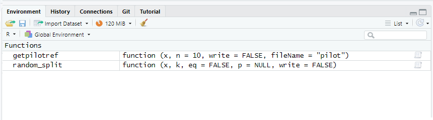

```{r setup, include = FALSE}
knitr::opts_chunk$set(
  collapse = TRUE,
  comment = "#>"
)
```

## About

When screening for a systematic review or meta-analysis, we conduct several pilot screening rounds. Pilot screenings help us refine our search string, decision tree, and increase the overall accuracy of our screening for literature reviews [check out this nice guide from the I-DEEL team for more info: @foo2021].

During a pilot screening, we want to select a random subset of references that would be a representative sample of the full set. When possible, screening rounds are conducted in collaboration with other reviewers. To speed up the screening process, we sometimes want to randomly allocate a subset of papers to a collaborator by splitting a reference list into subsets.

There are two reasons we'd want to automate the selection and splitting of a reference list:

1\. It can be time consuming to select papers (\\\>100 papers is tedious to select by hand!)

2\. We are not really good at selecting things at random (actually computers aren't really good at selecting truly at random either\\\*)

There are several different ways we can (pseudo)-randomly split and assign a dataset, here are two functions.

## Load functions

First step is to load the functions in your environment:

-   `getpilot` : randomly select n number of papers from file

-   `random_split` : randomly split dataframe (reference list) between k collaborators

These are not available in a package unfortunately :(

```{r}
# Load functions 
source("https://raw.githubusercontent.com/coraliewilliams/splitref/main/R/functions/functions_splitref.R?token=GHSAT0AAAAAAB47OVSXA77FY4ZIVASEJRW6ZDEQFTQ")
```

You should now see them loaded in your global environment:



### Example data: butterfly reference list

An example list of references of papers in Ecology & Evolutionary Biology having the word "butterflies" in their title is used to demonstrate how to use the functions.

The reference list was searched on Web of Science on 04/12/2022 with the following search string: TI=((butterfl\*)) AND WC=("Ecology" OR "Evolutionary Biology") leading to 677 search results.

Load example csv file that was exported from Rayyan :

```{r}
articles <- read.csv("https://raw.githubusercontent.com/coraliewilliams/2022/main/data/articles_butterfly.csv")
```

## 1. Get random pilot set

Let's get a pilot set of 20 papers:

```{r}
getpilotref(articles, n=20)
```


## 2. Split dataframe for collaboration

Firstly let's try the default with equal splits across 3 collaborators, then 15 collaborators:


```{r eval=FALSE}
split3 <- random_split(articles, k=3)
split15 <- random_split(articles, k=15)
```


Now, secondly, let's try with providing proportions for each split, for example when one collaborator has more time than the others:

```{r eval=FALSE}
split3_uneq <- random_split(articles, 3, eq=F, p=c(0.5,0.25,0.25))
```


Check that the function throws an error when given incorrect arguments:

```{r eval=FALSE}
random_split(articles, k="abc")
random_split(articles, k=100000)
random_split(articles, k=-2)
random_split(articles, k=1.5)
random_split(articles, k=3, p=c(0.2,0.3,0.5))
random_split(articles, k=2, eq=F)
```

Save manually files as csv:

```{r eval=FALSE}
# save each split from reference list as dataframe
rand_split_list <- random_split(articles, 3, eq=F, p=c(0.5,0.25,0.25))
split1 <- data.frame(rand_split_list[1])
split2 <- data.frame(rand_split_list[2])
split3 <- data.frame(rand_split_list[3])

# save files
write_csv(split1, "~/PhD/1_Sim/2_SysReview/screening/simstudies_split1.csv", na="")
write_csv(split2, "~/PhD/1_Sim/2_SysReview/screening/simstudies_split2.csv", na="")
write_csv(split3, "~/PhD/1_Sim/2_SysReview/screening/simstudies_split3.csv", na="")
```


Or use the write=T argument to save automatically all files as csv in your working directory:

```{r eval=FALSE}
rand_split_list <- random_split(articles, 3, eq=F, p=c(0.5,0.25,0.25), write=T)
```


Any issues, feedback or comments: coralie.williams@unsw.edu.au


## Alternatives?

```{r, message=FALSE, eval=FALSE}
library(randomizr)
```

## References

Ouzzani, M., Hammady, H., Fedorowicz, Z., & Elmagarmid, A. (2016). Rayyan---A web and mobile app for systematic reviews. *Systematic Reviews*, *5*(1), 210. <https://doi.org/10.1186/s13643-016-0384-4>

R Core Team (2022). R: A language and environment for statistical computing. R Foundation for Statistical Computing, Vienna, Austria. URL <https://www.R-project.org/.>
